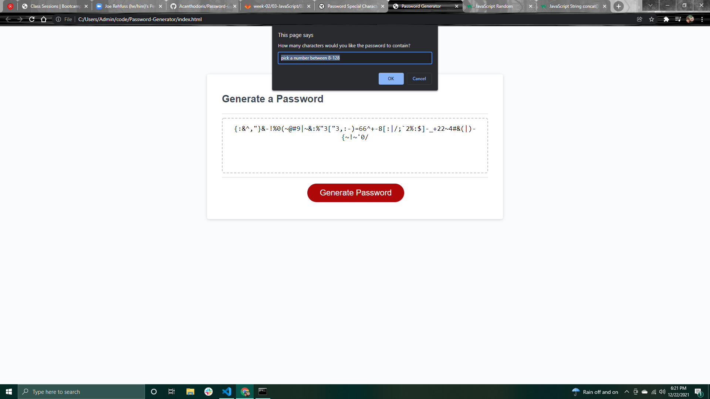

# Password-Generator
Creating a password generator with JavaScript

Creating a portfolio to test my HTML, CSS, and JavaScript skills.

Changes made:

GitHub:
https://github.com/Acanthodoris/Password-Generator

GitHub Page:
https://acanthodoris.github.io/Password-Generator/

Screenshot:

Credits:
https://www.w3schools.com/jsref/met_win_prompt.asp
https://www.w3schools.com/jsref/met_win_confirm.asp
https://www.w3schools.com/js/js_random.asp
https://www.w3schools.com/jsref/jsref_concat_string.asp
https://owasp.org/www-community/password-special-characters